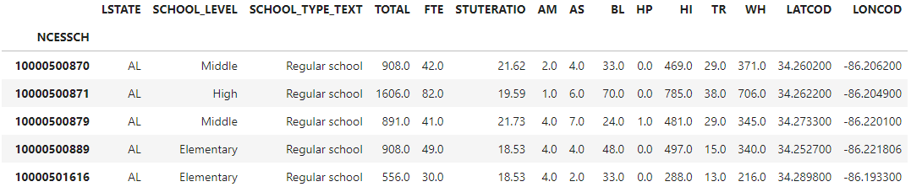

# Unit 4 Homework Assignment: US School Analysis

## Background

Congratulations! You have been hired as a data analyst for a the Department of Education. Your first task is to analyze the dataset from the most recent Public School Characteristics Survey which contains information about public schools in the United States. Your primary goal is to clean and research the data from the latest school survey and begin investigating and comparing states on their Student/Teacher Ratios. If you have extra time, your manager would like to see what other insights could be unearthed in this data.

For this homework assignment, you have three main tasks:

1. [Read in and Explore the School Data](#Prepare-the-Data)

2. [Clean and Visualize the Data](#Clean-and-Visualize)

3. [Perform Your Analysis](#Perform-the-Analysis)

---

## Instructions

**File:** [Schools Analysis Starter Code](Starter_Code/public_school_analysis.ipynb)
**GitHub:** Create a **new** GitHub Repository for this homework and clone it to your machine. Once cloned copy the contents of the **Starter_Code** folder in the class repo to your new homework repo. Complete the assignment in that repository.

### Prepare the Data

First, read and clean several CSV files for analysis. The CSV files include the . Use the [Schools Analysis Starter Code](Starter_Code/public_school_analysis.ipynb) to complete the following steps:

1. Read in the data:

   - Use the `pd.read_csv()` function to read the "Public_School_Characteristics_2020-21.csv" file located in the "Resources" folder and assign it to a variable named `data`.

   - Load the dataset called "public_school_locations.csv" and "school_data_dictionary.csv" from the Resources folder included in the Starter_Code.

   - Read in the "public_school_locations.csv" file using `pd.read_csv()` and assign it to a variable named `locations`.

   - Read in the "school_data_dictionary.csv" file using `pd.read_csv()` and assign it to a variable named `dictionary`.

   - Display the contents of each dataframe as you read them in.

2. Perform data exploration and preparation:

   - Use the `.isin()` function on the `dictionary` DataFrame to keep only the fields that appear in the `data` DataFrame.

   - Look at the field descriptions to familiarize yourself with the columns in the dataset. Feel free to rename any columns to your liking. Identify which column is the unique identifier in the dataset.

   - Once you have selected the unique ID double check if it is indeed unique by comparing the number of unique values of that column to the total number of rows in the `data` DataFrame.

   - Change the name of the unique ID column in both the `locations` and `data` DataFrames to match and set them as the index in both DataFrames. Display both dataframes to verify.

   - Join the `locations` and `data` DataFrames together using `pd.concat()` and display the resultant Dataframe

   - Get the value counts for the "SCHOOL_TYPE_TEXT" column in the `data` DataFrame.

   - Create a subset of the `data` DataFrame that only includes regular schools by using the condition `data['SCHOOL_TYPE_TEXT'] == 'Regular school'`. Display the `regular_schools` DataFrame.
   
   
   
### Clean and Visualize

3. Clean the data and deal with null values:

   - Check for null values in the `regular_schools` DataFrame.

   - Fill some of the columns in the `regular_schools` DataFrame with 0 where it makes sense. **NOTE:** Some columns have nulls when 0 students of a particular demographic are enrolled and probably should not be droppped. You don't want to lose too much data by droping all nulls immediately.

   - Verify the changes to null values by again checking for nulls.

   - Assuming you are happy with your initial changes. Drop the remaining null values in the `regular_schools` DataFrame.

   - Verify that no null values remain in the `regular_schools` DataFrame.

4. Plot to help clean the data:

   - Plot a histogram of the "TOTAL" column in the `regular_schools` DataFrame using `.plot(kind='hist', bins=100)`.

   - Plot a histogram of the "FTE" column in the `regular_schools` DataFrame using `.plot(kind='hist', bins=100)`.

   - Plot a histogram of the "STUTERATIO" column in the `regular_schools` DataFrame using `.plot(kind='hist', bins=100)`.
   
**Notice** how these plots are not very useful. They have outliers that are probably errors in the data. To deal with this we will filter out those outliers and re-plot the histograms.

   - Create a filtered DataFrame named `total_filtered` by removing 0s and outliers above the 99th quantile in the "TOTAL" column of the `regular_schools` DataFrame.

   - Plot a histogram of the "TOTAL" column in the `total_filtered` DataFrame using `.plot(kind='hist', bins=100)`.

   - Create a filtered DataFrame named `fte_filtered` by removing 0s and outliers above the 99th quantile in the "FTE" column of the `regular_schools` DataFrame.

   - Plot a histogram of the "FTE" column in the `fte_filtered` DataFrame using `.plot(kind='hist', bins=100)`.

   - Create a filtered DataFrame named `ratio_filtered` by removing 0s and outliers above the 99th quantile in the "STUTERATIO" column of the `regular_schools` DataFrame.

   - Plot a histogram of the "STUTERATIO" column in the `ratio_filtered` DataFrame using `.plot(kind='hist', bins=100)`

### Perform the Analysis

5. Generate a correlation plot to understand data relationships:

    - Import the seaborn library using `import seaborn as sns`.

    - Create a correlation heatmap for the columns in the `regular_schools` DataFrame using `sns.heatmap()` with appropriate parameters.

6. Generate geographic plots:

    - Plot only schools from the 48 contiguous US states or the 50 US states (excluding territories and PR) by following these steps:
    
    - Plot a scatter plot of longitude and latitude using `.plot.scatter()` with appropriate parameters and adjust the figsize to your liking.

    - Plot only schools in your state by creating a scatter plot of longitude and latitude filtering for a single state with appropriate parameters and adjust the figsize to your liking.

7. School Quality Analysis: Student/Teacher Ratios:

    - Use the filtered DataFrame `ratio_filtered` to group the data by state and calculate the average student/teacher ratio by state.

    - Assign the result to a variable named `ratio_by_state` and display the `ratio_by_state` DataFrame.

    - Calculate the mean of the student/teacher ratio for all states combined.

    - Calculate the standard deviation of the student/teacher ratio for all states combined.

    - Plot a bar plot of the student/teacher ratios for each state sorted from highest to lowest.

    - Plot a box plot of the student/teacher ratios for all the states combined.

8. List or plot the highest and lowest 5 states based on the student/teacher ratio:

    - Get the highest 5 states based on the student/teacher ratio and print the results or plot a bar plot of highest 5 states.

    - Get the lowest 5 states based on the student/teacher ratio and print the results or plot a bar plot of lowest 5 states.

9. Print your state's student/teacher ratio:

    - Access the student/teacher ratio for your state and print the value of your states Student/Teacher Ratio.
    
10. Summarize your findings:

    - Reflect on the analysis and plots you have generated.

        - Were there any interesting correlations between variables?

        - How does your state compare to other states in terms of student/teacher ratio?

        - Based on your familiarity with the data, would you have made any different decisions in the earlier cleaning stages?

        - Discuss any interesting observations or insights you gained from analyzing the data.

        - Identify any other analysis or plots that could be performed with this dataset.

11. Bonus (Optional):

    - Generate additional interesting analysis or plots based on your exploration of the dataset. Be creative and explore various aspects of the data.

---

## Hints

* The Pandas functions used in class this week will be useful for this assignment.

* Be sure to use `head()` or `tail()` when you want to look at your data, but don't want to print to a large DataFrame.

## Submission

1. Use the provided starter Jupyter Notebook to house the code for your data preparation, analysis, and visualizations. Put any analysis or answers to assignment questions in raw text (markdown) cells in the report.

2. Submit your notebook to a new GitHub repository. Make several commits as you work on the assignment.

3. Add the URL of your GitHub repository to your assignment when submitting via Canvas.

---

### Requirements

#### Data Preparation  (20 points)

##### To receive all points, you must:

* Use Pandas to read each CSV file in as a DataFrame. (3 points)
* Detect and remove all null values. (4 points)
* Use the data dictionary to understand the data. (5 points)
* Join the location and data csvs into a single DataFrame. (8 points)

#### Analysis (20 points)

##### To receive all points, your code must:

* Calculate and plot a histogram of each of the 3 columns specified. (2 points)
* Create a box plot for for the ratios by state. (2 points)
* Calculate the standard deviation and mean for the national student teacher ratio. (4 points)
* Determine which how best to deal with outliers. (3 points)
* Re-Plot Histograms after removing outliers. (2 points)
* Answer the analysis questions at the end of the activity (8 points)

#### Visualizations (30 points)

##### To receive all points, your code must:

* Use appropriate sizes and settings for each visualization. (4 points)
* Visualize the Student/Teacher ratios using a bar plot. (5 points)
* Plot geographic data for only the US states or Contiguous US states. (8 points)
* Plot a correlation heatmap using seaborn. (5 points)
* Plot the schools in your state. (8 points)

#### Coding Conventions and Formatting (10 points)

##### To receive all points, your code must:

* Place imports at the beginning of the file, just after any module comments and docstrings and before module globals and constants. (3 points)
* Name functions and variables with lowercase characters and with words separated by underscores. (2 points)
* Follow Don't Repeat Yourself (DRY) principles by creating maintainable and reusable code. (3 points)
* Use concise logic and creative engineering where possible. (2 points)

#### Deployment and Submission (10 points)

##### To receive all points, you must:

* Submit a link to a GitHub repository that’s cloned to your local machine and contains your files. (5 points)
* Include appropriate commit messages in your files. (5 points)

#### Code Comments (10 points)

##### To receive all points, your code must:

* Be well commented with concise, relevant notes that other developers can understand. (10 points)

---

© 2021 Shaolin AI. All Rights Reserved.

Congratulations on completing the US School Analysis homework assignment! You have explored and analyzed the dataset to gain insights into public schools in the United States. 
